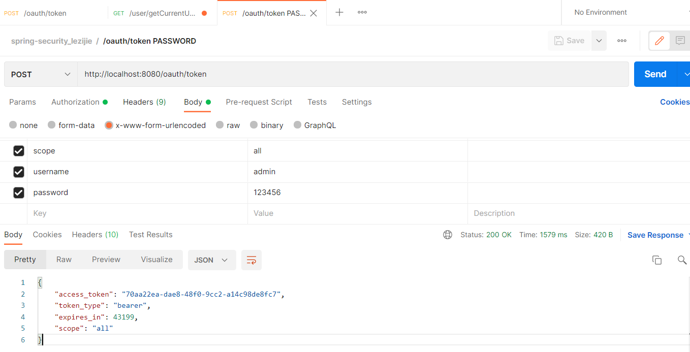
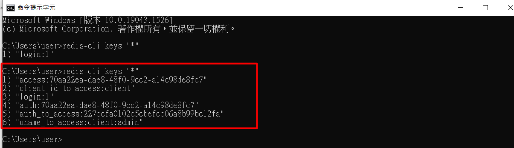

# Spring Security

## 1、學習目標


## 2、Spring Security


## 3、Oauth2 認證


## 4、Spring Security Oauth2 

### 4.1、授權服務器


### 4.2、Spring Security Oauth2 架構


```xml
<?xml version="1.0" encoding="UTF-8"?>
<project xmlns="http://maven.apache.org/POM/4.0.0" xmlns:xsi="http://www.w3.org/2001/XMLSchema-instance"
	xsi:schemaLocation="http://maven.apache.org/POM/4.0.0 https://maven.apache.org/xsd/maven-4.0.0.xsd">
	<modelVersion>4.0.0</modelVersion>
	<parent>
		<groupId>org.springframework.boot</groupId>
		<artifactId>spring-boot-starter-parent</artifactId>
		<version>2.6.3</version>
		<relativePath/> <!-- lookup parent from repository -->
	</parent>
	<groupId>com.example</groupId>
	<artifactId>spring-security-oauth2</artifactId>
	<version>0.0.1-SNAPSHOT</version>
	<packaging>war</packaging>
	<name>spring-security-oauth2</name>
	<description>Demo project for Spring Boot</description>
	<properties>
		<java.version>1.8</java.version>
		<spring-cloud.version>Greenwich.SR6</spring-cloud.version>
	</properties>
	<dependencies>
		<dependency>
			<groupId>org.springframework.boot</groupId>
			<artifactId>spring-boot-starter-web</artifactId>
		</dependency>

		<dependency>
			<groupId>org.springframework.cloud</groupId>
			<artifactId>spring-cloud-starter-oauth2</artifactId>
		</dependency>
		<dependency>
			<groupId>org.springframework.cloud</groupId>
			<artifactId>spring-cloud-starter-security</artifactId>
		</dependency>

		<dependency>
			<groupId>org.springframework.boot</groupId>
			<artifactId>spring-boot-starter-tomcat</artifactId>
			<scope>provided</scope>
		</dependency>
		<dependency>
			<groupId>org.springframework.boot</groupId>
			<artifactId>spring-boot-starter-test</artifactId>
			<scope>test</scope>
		</dependency>
	</dependencies>

	<dependencyManagement>
		<dependencies>
			<dependency>
				<groupId>org.springframework.cloud</groupId>
				<artifactId>spring-cloud-dependencies</artifactId>
				<version>${spring-cloud.version}</version>
				<type>pom</type>
				<scope>import</scope>
			</dependency>
		</dependencies>
	</dependencyManagement>

	<build>
		<plugins>
			<plugin>
				<groupId>org.springframework.boot</groupId>
				<artifactId>spring-boot-maven-plugin</artifactId>
			</plugin>
		</plugins>
	</build>

</project>
```


### 4.3、授權碼模式

```
http://localhost:8080/oauth/authorize?response_type=code&client_id=client&redirect_uri=https://www.google.com/&scope=all
```


### 4.4、密碼模式


### 4.5、在 Redis 中存儲 token


```xml
		<dependency>
			<groupId>org.springframework.boot</groupId>
			<artifactId>spring-boot-starter-data-redis</artifactId>
		</dependency>
		<dependency>
			<groupId>org.apache.commons</groupId>
			<artifactId>commons-pool2</artifactId>
		</dependency>
```


```java
@Configuration
@EnableWebSecurity
public class SecurityConfig extends WebSecurityConfigurerAdapter {

	@Bean
	public PasswordEncoder passwordEncoder() {
		return new BCryptPasswordEncoder();
	}

	@Bean
	@Override
	public AuthenticationManager authenticationManager() throws Exception {
		return super.authenticationManager();
	}

	@Override
	protected void configure(HttpSecurity http) throws Exception {
		http.authorizeRequests()
				.antMatchers("/oauth/**", "/login/**", "/logout/**")
				.permitAll()
				.anyRequest()
				.authenticated()
				.and()
				.formLogin()
				.permitAll()
				.and()
				.csrf().disable();
	}
}
```


```java
@Configuration
@EnableAuthorizationServer
public class AuthorizationServerConfig extends AuthorizationServerConfigurerAdapter {
	@Autowired
	private PasswordEncoder passwordEncoder;
	@Autowired
	private AuthenticationManager authenticationManager;
	@Autowired
	private UserService userService;
	@Autowired
	private TokenStore tokenStore;

	@Override
	public void configure(AuthorizationServerEndpointsConfigurer endpoints) throws Exception {
		endpoints.authenticationManager(authenticationManager)
				.userDetailsService(userService)
				.tokenStore(tokenStore);
	}

	@Override
	public void configure(ClientDetailsServiceConfigurer clients) throws Exception {
		clients
				// 實務上可能不放內存
				.inMemory()
				// 客戶端 ID
				.withClient("client")
				// 秘鑰
				.secret(passwordEncoder.encode("112233"))
				// 重定向地址
				.redirectUris("https://www.google.com/")
				// 授權範圍
				.scopes("all")
				/**
				 * 授權類型
				 * authorization_code: 授權碼模式
				 * password: 密碼模式
				 */
				.authorizedGrantTypes("authorization_code", "password");
	}
}

```


```java
@Configuration
public class RedisConfig {
	@Autowired
	private RedisConnectionFactory redisConnectionFactory;

	@Bean
	public TokenStore tokenStore() {
		return new RedisTokenStore(redisConnectionFactory);
	}
}
```







## 5、JWT

### 5.1、常見的認證機制

#### 5.1.1、HTTP Basic Auth


#### 5.2.2、Cookie Auth


#### 5.1.3、OAuth


#### 5.1.4、Token Auth


### 5.2、JWT 簡介

#### 5.2.1、什麼是 JWT


#### 5.2.2、JWT 組成


##### 5.2.2.1、頭部(Header)


##### 5.2.2.2、負載


##### 5.2.2.3、簽證/簽名(Signature)


### 5.3、JJWT 簡介

#### 5.3.1、什麼是 JJWT


#### 5.3.2、快速入門

##### 5.3.2.1、token 的創建

```xml

```


##### 5.3.2.2、token 的解析


##### 5.3.2.3、token 過期校驗


##### 5.3.2.4、自定義 claims


## 6、Spring Security OAuth2 整合 JWT

### 6.1、整合 JWT


### 6.2、擴展 JWT 中存儲的內容


### 6.3、Java 中解析 JWT 中的內容

```xml
		<dependency>
			<groupId>io.jsonwebtoken</groupId>
			<artifactId>jjwt</artifactId>
			<version>0.9.1</version>
		</dependency>
```


### 6.4、刷新令牌


